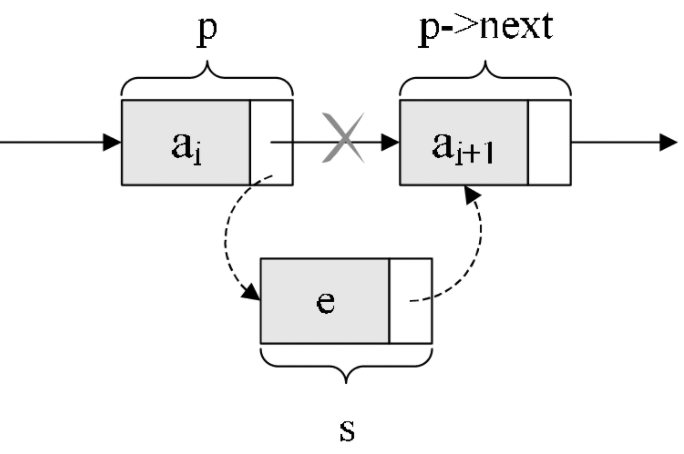

# LearningNote.Instance.Csharp
基础数据结构的学习笔记与C#实例

* [LearningNote\.Instance\.Csharp](#learningnoteinstancecsharp)
* [线性表](#线性表)
  * [线性表的基本定义](#线性表的基本定义)
  * [线性表的存储结构](#线性表的存储结构)
    * [顺序表](#顺序表)
    * [链表](#链表)
  * [顺序表基础](#顺序表基础)
    * [静态顺序表之数组](#静态顺序表之数组)
      * [数组元素为值类型时](#数组元素为值类型时)
      * [数组元素为引用类型时](#数组元素为引用类型时)
    * [动态顺序表之ArrayList与List](#动态顺序表之arraylist与list)
      * [简单好用但不是类型安全的ArrayList](#简单好用但不是类型安全的arraylist)
        * [Add()添加新元素](#add添加新元素)
        * [RemoveAt()移除指定元素](#removeat移除指定元素)
        * [EnsureCapacity()动态调整数组大小](#ensurecapacity动态调整数组大小)
      * [\.NET2\.0出现的泛型版本：List](#net20出现的泛型版本list)
        * [泛型接口](#泛型接口)
        * [泛型方法](#泛型方法)
  * [单链表基础](#单链表基础)
    * [单链表的节点结构](#单链表的节点结构)
    * [单链表的总体结构](#单链表的总体结构)
  * [单链表实现](#单链表实现)
    * [单链表节点的定义](#单链表节点的定义)
    * [单链表节点的新增](#单链表节点的新增)
      * [默认在尾节点后插入新节点](#默认在尾节点后插入新节点)
    * [指定在某个节点后插入新节点](#指定在某个节点后插入新节点)
    * [单链表节点的移除](#单链表节点的移除)
  * [双链表基础](#双链表基础)
    * [双链表的节点结构](#双链表的节点结构)
    * [双链表的总体结构](#双链表的总体结构)
    * [双链表实现](#双链表实现)
    * [双链表中插入新节点](#双链表中插入新节点)
      * [默认在尾节点之后插入新节点](#默认在尾节点之后插入新节点)
      * [可选在尾节点之前插入新节点](#可选在尾节点之前插入新节点)
      * [双链表中移除某个节点](#双链表中移除某个节点)
  * [\.NET中的ListDictionary与LinkedList](#net中的listdictionary与linkedlist)
    * [LinkedList—神奇的泛型双向链表](#linkedlist神奇的泛型双向链表)
    * [ListDictionary—基于key/value的单链表](#listdictionary基于keyvalue的单链表)
  * [循环链表基础](#循环链表基础)
    * [循环链表基础](#循环链表基础-1)
    * [循环链表的O(1)访问时间](#循环链表的o1访问时间)
  * [循环链表实现](#循环链表实现)
    * [循环链表节点的定义实现](#循环链表节点的定义实现)
    * [循环链表新节点的插入实现](#循环链表新节点的插入实现)
    * [循环链表当前节点的移除实现](#循环链表当前节点的移除实现)
  * [循环链表与约瑟夫问题](#循环链表与约瑟夫问题)
    * [何为约瑟夫问题](#何为约瑟夫问题)
    * [使用循环链表解决约瑟夫问题](#使用循环链表解决约瑟夫问题)
    * [解决约瑟夫问题](#解决约瑟夫问题)
* [栈和队列](#栈和队列)
  * [栈的概念及操作](#栈的概念及操作)
  * [栈的基本操作](#栈的基本操作)
    * [栈的插入操作，叫作进栈，也称压栈、入栈：](#栈的插入操作叫作进栈也称压栈入栈)
    * [栈的删除操作，叫作出栈，也有的叫作弹栈：](#栈的删除操作叫作出栈也有的叫作弹栈)
  * [栈的基本实现](#栈的基本实现)
    * [栈的顺序存储实现](#栈的顺序存储实现)
      * [入栈操作](#入栈操作)
      * [出栈操作](#出栈操作)
    * [栈的链式存储实现](#栈的链式存储实现)
      * [节点的定义实现](#节点的定义实现)
      * [入栈操作的实现](#入栈操作的实现)
      * [出栈操作的实现](#出栈操作的实现)
    * [、\.NET中的Stack](#net中的stack)
  * [队列](#队列)
    * [队列的概念及操作](#队列的概念及操作)
      * [队列的基本特征](#队列的基本特征)
      * [队列的基本操作](#队列的基本操作)
    * [队列的基本实现](#队列的基本实现)
      * [队列的顺序存储实现](#队列的顺序存储实现)
        * [入队：Enqueue](#入队enqueue)
        * [出队：Dequeue](#出队dequeue)
    * [队列的链式存储实现](#队列的链式存储实现)
      * [入队：Enqueue](#入队enqueue-1)
      * [出队：Dequeue](#出队dequeue-1)
    * [循环队列](#循环队列)
        * [入队与出队的索引位置如何确定？](#入队与出队的索引位置如何确定)
        * [在队列容量固定时如何判断队列空还是队列满？](#在队列容量固定时如何判断队列空还是队列满)
    * [\.NET中的Queue](#net中的queue)
* [树与二叉树](#树与二叉树)
  * [树](#树)
    * [树的基本概念](#树的基本概念)
    * [树的基本术语](#树的基本术语)
  * [二叉树](#二叉树)
    * [二叉树的概念和特点](#二叉树的概念和特点)
    * [二叉树的顺序存储结构](#二叉树的顺序存储结构)
    * [二叉树的链式存储结构](#二叉树的链式存储结构)
  * [二叉树的代码实现](#二叉树的代码实现)
    * [二叉树的C\#代码实现](#二叉树的c代码实现)
      * [二叉树节点的定义](#二叉树节点的定义)
      * [二叉树的创建实现](#二叉树的创建实现)
      * [二叉树的递归遍历](#二叉树的递归遍历)
* [图](#图)
  * [多对多的复杂关系](#多对多的复杂关系)
  * [纷繁冗多的术语](#纷繁冗多的术语)
  * [图的存储结构](#图的存储结构)
    * [邻接矩阵表示法](#邻接矩阵表示法)
    * [邻接表表示法](#邻接表表示法)
  * [图的模拟实现](#图的模拟实现)
    * [总体设计结构](#总体设计结构)
      * [链表节点定义](#链表节点定义)
      * [邻接表总体定义](#邻接表总体定义)
    * [基本方法实现](#基本方法实现)
      * [添加一个顶点](#添加一个顶点)
      * [添加一条边](#添加一条边)
  * [深度优先搜索遍历](#深度优先搜索遍历)
  * [广度优先搜索遍历](#广度优先搜索遍历)
  * [生成树与最小生成树](#生成树与最小生成树)
    * [生成树](#生成树)
    * [最小生成树](#最小生成树)
  * [Prim算法](#prim算法)
  * [Kruskal算法](#kruskal算法)
  * [单源点最短路径](#单源点最短路径)
  * [Dijkstra算法](#dijkstra算法)
  * [Floyd算法](#floyd算法)
* [查找](#查找)
  * [顺序查找](#顺序查找)
  * [二分查找](#二分查找)
* [排序](#排序)
  * [插入类排序](#插入类排序)
    * [直接插入排序](#直接插入排序)
    * [希尔排序](#希尔排序)
  * [交换类排序](#交换类排序)
    * [冒泡排序](#冒泡排序)
    * [快速排序](#快速排序)
  * [选择类排序](#选择类排序)
    * [简单选择排序](#简单选择排序)
    * [堆排序](#堆排序)
      * [基本思想](#基本思想)
    * [处理步骤](#处理步骤)
  * [归并类排序](#归并类排序)
    * [二路归并排序](#二路归并排序)

# 线性表

## 线性表的基本定义

线性表：零个或多个数据元素的有限序列。线性表中的元素在位置上是有序的，类似于储户去银行排队取钱，人们依次排着队，排在前面的先取，排在后面的则后取。这种位置上的有序性就是一种线性关系。由此可以看出：线性表的前后两个元素存在一一对应关系。

>需要注意的是，这种前后关系是逻辑意义上而非物理意义上的，就好比如果银行做了改革，使用排队机进行排队，所有储户分散在银行的各个角落，他们取钱的顺序是根据储户从排队机获取的纸条上的号码来决定的。

## 线性表的存储结构

### 顺序表

线性表的顺序存储结构是指【用一块地址连续的存储空间依次存储线性表中的数据元素】。就好像我们刚刚提到的改革之前的银行，需要在业务窗口前排队等候办理。由此可以看出：在顺序表中，逻辑上相邻的元素在物理上也是相邻的.

### 链表

相比顺序表需要预先占用一块事先分配好的存储空间，链表就灵活一些。链表中逻辑上相邻的元素在物理上可以不相邻。这就好像改革之后的银行，人们办理业务的顺序是由手上的小纸条的号码来决定。在某些特定场合，链表的使用优先于顺序表。

## 顺序表基础

### 静态顺序表之数组

在日常编程中，在处理一组数据时，最常使用的数据类型就是数组。它是线性表的顺序存储结构在程序语言中最直接的表现形式。

数组是最基础也是存取速度最快的一种集合类型，在.NET中它是引用类型，也就是说它所需的内存空间会在托管堆上分配，一旦数组被创建，其中的所有元素会被初始化为它们的默认值。

>另外需要注意的是，当数组元素为值类型时，数组对象存放的是值类型对象本身。而当元素为引用类型时，数组对象存放的则是对象的引用（指针）。

#### 数组元素为值类型时

    int[] arrInt = new int[5];
    arrInt[2] = 5;
    arrInt[4] = 3;

下图展示了上面的数组arrInt在内存（这里如未说明都指在.NET中的内存分配）中的分配形式，可以看到值类型数组在被创建的同时就拥有了默认值0。

#### 数组元素为引用类型时

    // System.Windows.Forms.Control
    Control[] arrCtrl = new Control[5];
    arrCtrl[0] = new Button();
    arrCtrl[3] = new Label();

下图则展示了上面的数组arrCtrl在内存中的分配，可以看到在托管堆中划分了一块能够存放5个指针的内存区域，并且每个元素都被初始化为null。如果某个元素被赋值，那么会存放一个指向实际对象存储区域的指针。

>数组优点很多，缺点也很明显：在实际编程中，无法动态改变集合的大小。

### 动态顺序表之ArrayList与List<T>
  
如果需要动态地改变数组所占用的内存空间的大小，则需要以数组为基础做进一步的抽象以实现这个功能。在C#中，ArrayList被称为动态数组，它的存储空间可以被动态地改变，同时还有添加、删除元素的功能。
  
#### 简单好用但不是类型安全的ArrayList
    
##### Add()添加新元素

##### RemoveAt()移除指定元素
    
##### EnsureCapacity()动态调整数组大小
    
事实上，内存空间一旦分配是没有办法更改大小的。ArrayList其实使用“搬家”的方法来实现这个功能的，即当房子住不下这么多人的时候，那么换一个更大的新房子就行了。这里，ArrayList需要扩容时，会在内存空间中开辟一块新区域，容量为原来的2倍，并把所有元素都复制到新内存空间中。
    
#### .NET2.0出现的泛型版本：List<T>
    
由于ArrayList实际存放的是object对象（在.NET中object是万物之宗，即所有类型的父类），在进行存取操作时需要进行大量的装箱和拆箱操作，降低程序性能。于是，从.NET 2.0开始出现了泛型版本的List<T>，它完美取代了ArrayList。

##### 泛型接口

声明泛型接口时，与声明一般接口的区别是增加了一个<T>。一般来说，声明泛型接口与声明非泛型接口遵循相同的规则。泛型类型声明所实现的接口必须对所有可能的构造类型都保持唯一，否则无法确定该为某些构造类型调用哪个方法。
    
>在实例化泛型时也可以使用约束对类型参数的类型种类施加限制，约束是使用where上下文关键字指定的。下面列出了6种类型的约束： 
>T:结构——类型参数必须是值类型。可以指定除Nullable以外的任何值类型。 
>T:类——类型参数必须是引用类型。这一点也使用于任何类、接口、委托或数组类型。 
>T:new()——类型参数必须具有无参数的公共构造函数。当与其他约束一起使用时，new()约束必须最后指定。 
>T:<基类名>——类型参数必须是指定的基类或派生自指定的基类。 
>T:<接口名称>——类型参数必须是指定的接口或实现指定的接口。可以指定多个接口约束。约束接口也可以是泛型的。 
>T:U——为T提供的类型参数必须是为U提供的参数或派生自为U提供的参数。这称为裸类型约束。

    namespace Interface_Generic
    {
        //创建一个泛型接口
        public interface IGenericInterface<T>
        {
            T CreateInterface();
        }
        //实现上面泛型接口的泛型类
        public class Factory<T, T1> : IGenericInterface<T1> where T : T1, new()
        {
            public T1 CreateInterface()
            {
                return new T();
            }
        }
        class Program
        {
            static void Main(string[] args)
            {
                IGenericInterface<System.ComponentModel.IListSource> factory = 
                    new Factory<System.Data.DataTable, System.ComponentModel.IListSource>();
                //输出指定泛型的类型
                Console.WriteLine(factory.CreateInterface().GetType().ToString());
                Console.ReadLine();
            }
        }
    }
    
##### 泛型方法
    
泛型方法是在声明中包括了类型参数T的方法。泛型方法可以在类、结构或者接口中声明，这些类、结构、或接口本身可以使泛型或非泛型。如果在泛型类型声明中声明泛型方法，则方法体可以同时引用该方法的类型参数T和包含该方法的声明的类型参数T。
    
>泛型方法可以使用多类型参数进行重载。
    
    namespace Method_Generic
    {
        //建立一个公共类Finder
        public class Finder
        {
            public static int Find<T>(T[] items, T item)  //创建泛型方法
            {
                for (int i = 0; i < items.Length; i++)  
                {
                    if (items[i].Equals(item))
                    {
                        return i;
                    }
                }
                return -1;
            }
        }
        class Program
        {
            static void Main(string[] args)
            {
                int i = Finder.Find<int>(new int[] { 1, 2, 3, 4, 5, 6, 8, 9 }, 6);
                Console.WriteLine("6在数组中的位置："+i.ToString());
                Console.ReadLine();
            }
        }
    }
    

## 单链表基础

### 单链表的节点结构

在链表中，每个节点由两部分组成：数据域和指针域。
    
### 单链表的总体结构
    

    
链表就是由N个节点链接而成的线性表，如果其中每个节点只包含一个指针域那么就称为单链表，如果含有两个指针域那么就称为双链表。
    
>在线性表的链式存储结构中，为了便于插入和删除操作的实现，每个链表都带有一个头指针（或尾指针），通过头指针可以唯一标识该链表。从头指针所指向的节点出发，沿着节点的链可以访问到每个节点。

## 单链表实现

### 单链表节点的定义
    
    public class Node<T>
        {
            //数据域
            public T Item { get; set; }
            //指针域
            public Node<T> Next { get; set; }
            public Node() { }
            public Node(T item)
            {
                this.Item = item;
            }
        }

此处定义Node类为单链表的节点，其中包括了一个数据域Item与一个指针域Next（指向后继节点的位置）。
    
### 单链表节点的新增

#### 默认在尾节点后插入新节点
    
    public void Add(T value)
        {
            Node<T> newNode = new Node<T>(value);
            if (this.head == null)
            {
                // 如果链表当前为空则置为头结点
                this.head = newNode;
            }
            else
            {
                Node<T> prevNode = this.GetNodeByIndex(this.count - 1);
                prevNode.Next = newNode;
            }

            this.count++;
        }
    
首先判断头结点是否为空，其次依次遍历各节点找到尾节点的前驱节点，然后更改前驱节点的Next指针指向新节点即可。
    
### 指定在某个节点后插入新节点
    
    public void Insert(int index, T value)
        {
            Node<T> tempNode = null;
            if (index < 0 || index > this.count)
            {
                throw new ArgumentOutOfRangeException("index", "索引超出范围");
            }
            else if (index == 0)
            {
                if (this.head == null)
                {
                    tempNode = new Node<T>(value);
                    this.head = tempNode;
                }
                else
                {
                    tempNode = new Node<T>(value);
                    tempNode.Next = this.head;
                    this.head = tempNode;
                }
            }
            else
            {
                Node<T> prevNode = GetNodeByIndex(index - 1);
                tempNode = new Node<T>(value);
                tempNode.Next = prevNode.Next;
                prevNode.Next = tempNode;
            }

            this.count++;
        }

这里需要判断是否是在第一个节点进行插入，如果是则再次判断头结点是否为空。

### 单链表节点的移除
    

    
     public void RemoveAt(int index)
        {
            if (index == 0)
            {
                this.head = this.head.Next;
            }
            else
            {
                Node<T> prevNode = GetNodeByIndex(index - 1);
                if (prevNode.Next == null)
                {
                    throw new ArgumentOutOfRangeException("index", "索引超出范围");
                }

                Node<T> deleteNode = prevNode.Next;
                prevNode.Next = deleteNode.Next;

                deleteNode = null;
            }

            this.count--;
        }
    
移除某个节点只需将其前驱节点的Next指针指向要移除节点的后继节点即可。
    
## 双链表基础
    
###  双链表的节点结构
    

    
与单链表不同的是，双链表有两个指针域，一个指向前驱节点，另一个指向后继节点。
    
### 双链表的总体结构
    

双链表中，每个节点都有两个指针，指向前驱和后继，这样可以方便地找到某个节点的前驱节点和后继节点，这在某些场合中是非常实用的。
    
### 双链表实现
    
    public class DbNode<T>
    {
        public T Item { get; set; }
        public DbNode<T> Prev { get; set; }
        public DbNode<T> Next { get; set; }

        public DbNode()
        {
        }

        public DbNode(T item)
        {
            this.Item = item;
        }
    }
    
与单链表的节点定义不同的是，多了一个指向前驱节点的Prev指针域，可以方便地找到某个节点的前驱节点，从而不必重新遍历一次。
    
### 双链表中插入新节点
    

#### 默认在尾节点之后插入新节点
    
    public void AddAfter(T value)
        {
            DbNode<T> newNode = new DbNode<T>(value);
            if (this.head == null)
            {
                // 如果链表当前为空则置为头结点
                this.head = newNode;
            }
            else
            {
                DbNode<T> lastNode = this.GetNodeByIndex(this.count - 1);
                // 调整插入节点与前驱节点指针关系
                lastNode.Next = newNode;
                newNode.Prev = lastNode;
            }
            this.count++;
        }
    
#### 可选在尾节点之前插入新节点
    
    public void AddBefore(T value)
        {
            DbNode<T> newNode = new DbNode<T>(value);
            if (this.head == null)
            {
                // 如果链表当前为空则置为头结点
                this.head = newNode;
            }
            else
            {
                DbNode<T> lastNode = this.GetNodeByIndex(this.count - 1);
                DbNode<T> prevNode = lastNode.Prev;
                // 调整倒数第2个节点与插入节点的关系
                prevNode.Next = newNode;
                newNode.Prev = prevNode;
                // 调整倒数第1个节点与插入节点的关系
                lastNode.Prev = newNode;
                newNode.Next = lastNode;
            }
            this.count++;
        }
    
典型的四个步骤，调整插入节点与尾节点前驱节点的关系、插入节点与尾节点的关系。

当然，还可以在指定的位置之前或之后插入新节点，例如InsertAfter和InsertBefore方法
    
#### 双链表中移除某个节点
    

    
    public void RemoveAt(int index)
        {
            if (index == 0)
            {
                this.head = this.head.Next;
            }
            else
            {
                DbNode<T> prevNode = this.GetNodeByIndex(index - 1);
                if (prevNode.Next == null)
                {
                    throw new ArgumentOutOfRangeException("index", "索引超出范围");
                }

                DbNode<T> deleteNode = prevNode.Next;
                DbNode<T> nextNode = deleteNode.Next;
                prevNode.Next = nextNode;
                if(nextNode != null)
                {
                    nextNode.Prev = prevNode;
                }

                deleteNode = null;
            }
            this.count--;
        }
    
这里只需要将前驱节点的Next指针指向待删除节点的后继节点，将后继节点的Prev指针指向待删除节点的前驱节点即可。
    
## .NET中的ListDictionary与LinkedList<T>
    
在.NET中，已经为我们提供了单链表和双链表的实现，它们分别是ListDictionary与LinkedList<T>。从名称可以看出，单链表的实现ListDictionary不是泛型实现，而LinkedList是泛型实现。
    
### LinkedList—神奇的泛型双向链表
    
在.NET中，LinkedList<T>是使用地比较多的链表实现类，它位于System.Collections.Generic下，是一个通用的双向链表类，它不支持随机访问（即索引访问），但它实现了很多的新增节点的方法，例如：AddAfter、AddBefore、AddFirst以及AddLast等。其中，AddAfter是在现有节点之后添加新节点，AddBefore则是在现有节点之前添加新节点，AddFirst是在开头处添加，而AddLast则是在末尾处添加。
    
###  ListDictionary—基于key/value的单链表

ListDictionary位于System.Collection.Specialized下，它是基于键值对（Key/Value）的集合，微软给出的建议是：通常用于包含10个或10个以下项的集合。它的节点的数据域是一个键值对，而不是一个简单的value。
    
## 循环链表基础
    
### 循环链表基础
    

    
循环链表和单链表的主要差异就在于循环的判断条件上，原来是判断p.next是否为空，现在则是p.next不等于头结点，则循环未结束。
    
### 循环链表的O(1)访问时间
    
在单链表中，有了头结点，我们可以在O(1)时间访问到第一个节点，但如果要访问最后一个节点却需要O(n)的时间，因为我们需要对整个链表进行一次遍历。在循环链表中，我们可以借助尾节点来实现，即不用头指针，而是用指向终端结点的尾指针来表示循环链表，这时候无论是查找第一个节点还是最后一个节点都很方便，可以控制在O(1)的时间内，如下图所示。
    

    
从上图中可以看到，终端结点用尾指针（tail）指示，则查找终端结点是O(1)，而开始结点，其实就是tail.Next，其时间复杂也为O(1)。由此也可以联想到，在合并两个循环链表时，只需要修改两个链表的尾指针即可快速地进行合并。

## 循环链表实现

### 循环链表节点的定义实现
    
    public class CirNode<T>
    {
        public T Item { get; set; }
        public CirNode<T> Next { get; set; }

        public CirNode()
        {
        }

        public CirNode(T item)
        {
            this.Item = item;
        }
    }
    
这里跟单链表的节点定义实现并无区别。
    
### 循环链表新节点的插入实现

public void Add(T value)
        {
            CirNode<T> newNode = new CirNode<T>(value);
            if (this.tail == null)
            {
                // 如果链表当前为空则新元素既是尾头结点也是头结点
                this.tail = newNode;
                this.tail.Next = newNode;
                this.currentPrev = newNode;
            }
            else
            {
                // 插入到链表末尾处
                newNode.Next = this.tail.Next;
                this.tail.Next = newNode;
                // 改变当前节点
                if (this.currentPrev == this.tail)
                {
                    this.currentPrev = newNode;
                }
                // 重新指向新的尾节点
                this.tail = newNode;
            }

            this.count++;
        }

首先，这里的currentPrev字段是使用了前驱节点来标识当前节点，如要获取当前节点的值可以通过currentPrev.Next.Item来获得。其次，在最后将尾节点指针指向新插入的节点。
    
### 循环链表当前节点的移除实现
    
    public void Remove()
            {
                if (this.tail == null)
                {
                    throw new NullReferenceException("链表中没有任何元素");
                }
                else if (this.count == 1)
                {
                    // 只有一个元素时将两个指针置为空
                    this.tail = null;
                    this.currentPrev = null;
                }
                else
                {
                    if (this.currentPrev.Next == this.tail)
                    {
                        this.tail = this.currentPrev;
                    }
                    // 移除当前节点
                    this.currentPrev.Next = this.currentPrev.Next.Next;
                }

                this.count--;
            }
    
这里考虑到删除节点时必须寻找其前驱节点会导致链表进行遍历，故使用了当前节点的前驱节点来标识这个当前节点。移除当前节点只需要currentPrev.Next = currentPrev.Next.Next即可。

##  循环链表与约瑟夫问题
    
### 何为约瑟夫问题
    
据说著名犹太历史学家 Josephus 有过以下的故事：在罗马人占领乔塔帕特后，39 个犹太人与Josephus及他的朋友躲到一个洞中，39个犹太人决定宁愿死也不要被敌人抓到，于是决定了一个自杀方式，41个人排成一个圆圈，由第1个人开始报数，每报数到第3人该人就必须自杀，然后再由下一个重新报数，直到所有人都自杀身亡为止。然而 Josephus 和他的朋友并不想遵从，Josephus 要他的朋友先假装遵从，他将朋友与自己安排在第16个与第31个位置，于是逃过了这场死亡游戏。
    

    
以上就是著名的约瑟夫问题：N个人围成一圈，从第一个开始报数，第M个将被杀掉，最后剩下Q个。从围成一圈这里就启发了我们可以使用循环链表来解决该问题。
    
### 使用循环链表解决约瑟夫问题
    
#### 为CircularLinkedList添加Move()方法实现让当前节点向前移动N步
    
    public void Move(int step = 1)
        {
            if (step < 1)
            {
                throw new ArgumentOutOfRangeException("step", "移动步数不能小于1");
            }

            for (int i = 1; i < step; i++)
            {
                currentPrev = currentPrev.Next;
            }
        }
    
注意到这里循环是从1开始，因为currentPrev是当前节点的前驱节点，而不是真正的当前节点。
    
### 解决约瑟夫问题
    
    static void JosephusTest()
        {
            MyCircularLinkedList<int> linkedList = new MyCircularLinkedList<int>();
            string result = string.Empty;

            Console.WriteLine("Step1:请输入人数N");
            int n = Convert.ToInt32(Console.ReadLine());
            Console.WriteLine("Step2:请输入数字M");
            int m = Convert.ToInt32(Console.ReadLine());
            Console.WriteLine("Step3:报数游戏开始");
            // 添加参与人员元素
            for (int i = 1; i <= n; i++)
            {
                linkedList.Add(i);
            }
            // 打印所有参与人员
            Console.Write("所有参与人员：{0}", linkedList.GetAllNodes());
            Console.WriteLine("\r\n" + "-------------------------------------");
            result = string.Empty;

            while (linkedList.Count > 1)
            {
                // 依次报数：移动
                linkedList.Move(m);
                // 记录出队人员
                result += linkedList.CurrentItem + " ";
                // 移除人员出队
                linkedList.Remove();
                Console.WriteLine();
                Console.Write("剩余报数人员：{0}", linkedList.GetAllNodes());
                Console.Write("  开始报数人员：{0}", linkedList.CurrentItem);
            }
            Console.WriteLine("\r\n" + "Step4:报数游戏结束");
            Console.WriteLine("出队人员顺序：{0}", result + linkedList.CurrentItem);
        }
    
# 栈和队列
 
>在.NET中，值类型在线程栈上进行分配，引用类型在托管堆上进行分配。栈和队列都是常用的数据结构，它们的逻辑结构与线性表相通，不同之处则在于操作受某种特殊限制。因此，栈和队列也被称为操作受限的线性表。
    
## 栈的概念及操作
    
栈（stack）是限定仅在表尾进行插入和删除操作的线性表。其特点是：”后进先出“或”先进后出“。
    
## 栈的基本操作
    
### 栈的插入操作，叫作进栈，也称压栈、入栈：
    

### 栈的删除操作，叫作出栈，也有的叫作弹栈：
    

## 栈的基本实现
    
既然栈属于特殊的线性表，那么其实现也会有两种形式：顺序存储结构和链式存储结构。首先，对于Stack，我们希望能够提供以下几个方法供调用：
    
|方法|说明|
|----|----|
|`Stack<T>()`|创建一个空的栈|
|`void Push(T s)`|往栈中添加一个新元素|
|`T Pop()`|移除并返回最近添加的元素|
|`bool IsEmpty()`|栈是否为空|
|`int Size()`|栈中元素的个数|

### 栈的顺序存储实现
    
对于顺序存储，我们可以参照顺序表的实现方式，借助数组来存储各个数据元素，然后对这个数组进行一定的封装，提供指定的操作对数据元素进行插入和删除即可。
    
#### 入栈操作
    

    
    public void Push(T node)
        {
            if (index == nodes.Length)
            {
                // 增大数组容量
                ResizeCapacity(nodes.Length * 2);
            }

            nodes[index] = node;
            index++;
        }
    
借助数组来实现入栈操作，其关键之处就在于top指针的移动。这里index初始值为0，每次入栈一个则将index加1，即指向下一个即将入栈的位置。由于这里采用了动态扩容的机制，所以没有判断栈中元素个数是否达到了最大值。
    
#### 出栈操作

出栈操作需要先去的要出栈的元素，然后将index减1，即指向下一个即将出栈的元素的位置。
    
    public T Pop()
            {
                if(index == 0)
                {
                    return default(T);
                }

                T node = nodes[index - 1];
                index--;
                nodes[index] = default(T);

                if (index > 0 && index == nodes.Length / 4)
                {
                    // 缩小数组容量
                    ResizeCapacity(nodes.Length / 2);
                }
                return node;
            }

### 栈的链式存储实现
    
对栈的链式存储结构，我们可以参照单链表，为其设置一个头结点。这里，我们先来看看节点的定义：
    
#### 节点的定义实现

    public class Node<T>
    {
        public T Item { get; set; }
        public Node<T> Next { get; set; }

        public Node(T item)
        {
            this.Item = item;
        }

        public Node()
        { }
    }
    
#### 入栈操作的实现
    

实现Push方法，即向栈顶压入一个元素，首先保存原先的位于栈顶的元素，然后新建一个新的栈顶元素，然后将该元素的下一个指向原先的栈顶元素。
    
     public void Push(T item)
        {
             Node<T> oldNode = first;
             first = new Node<T>();
             first.Item = item;
             first.Next = oldNode;

             index++;
         }
    
#### 出栈操作的实现
    

    
实现Pop方法，首先保存栈顶元素的值，然后将栈顶元素设置为下一个元素：
    
     public T Pop()
    {
        T item = first.Item;
        first = first.Next;
        index--;

        return item;
    }
    
### .NET中的Stack<T>
    
在.NET中Stack的实现是基于数组来实现的，在初始化时为其设置了一个默认的数组大小，在Push方法中当元素个数达到数组长度时，扩充2倍容量，然后将原数组拷贝到新的数组中。Pop方法中则跟我们刚刚实现的代码基本相同。
    
## 队列
  
>与栈类似，队列也是属于操作受限的线性表，不过队列是只允许在一端进行插入，在另一端进行删除。在其他数据结构如树的一些基本操作中（比如树的广度优先遍历）也需要借助队列来实现
    
### 队列的概念及操作
    
#### 队列的基本特征
    
队列（queue）是只允许在一端进行插入操作，而在另一端进行删除操作的线性表。它是一种先进先出（First In First Out）的线性表，简称FIFO。允许插入的一端称为队尾，允许删除的一端称为队头。

#### 队列的基本操作
    

入队（Enqueue）：将一个数据元素插入队尾；
    
出队（Dequeue）：读取队头节点数据并删除该节点；

### 队列的基本实现
    
既然队列也属于特殊的线性表，那么其实现也会有两种形式：顺序存储结构和链式存储结构。首先，对于Queue，我们希望能够提供以下几个方法供调用：
    
|方法|说明|
|----|----|
|Queue<T>()|创建一个空的队列|
|void Enqueue(T s)|往队列中添加一个新的元素|
|T Dequeue()|移除队列中最早添加的元素|
|bool IsEmpty()|队列是否为空|
|int Size()|队列中元素的个数|
    
####  队列的顺序存储实现
    
与Stack不同，在队列中我们需要定义一个head队头“指针”和tail队尾“指针”，当新元素入队时tail+1，当老元素出队时head+1。下面重点来看看Enqueue和Dequeue两个方法的代码实现。
    
##### 入队：Enqueue
    
     public void EnQueue(T item)
        {
            if (Size == items.Length)
            {
                // 扩大数组容量
                ResizeCapacity(items.Length * 2);
            }

            items[tail] = item;
            tail++;
            size++;
        }
    
新元素入队后，tail队尾指针向前移动指向下一个新元素要插入的位置；这里仍然模仿.NET中的实现，在数组容量不足时及时进行扩容以容纳新元素入队。
    
##### 出队：Dequeue
    
public T DeQueue()
        {
            if (Size == 0)
            {
                return default(T);
            }

            T item = items[head];
            items[head] = default(T);
            head++;

            if (head > 0 && Size == items.Length / 4)
            {
                // 缩小数组容量
                ResizeCapacity(items.Length / 2);
            }

            size--;
            return item;
        }
    
在对老元素进行出队操作时，首先取得head指针所指向的老元素，然后将head指针向前移动一位指向下一个将出队的老元素。这里将要出队的元素所在数组中的位置重置为默认值。最后判断容量是否过小，如果是则进行数组容量的缩小。

### 队列的链式存储实现
    
跟Stack链式存储结构不同，在Queue链式存储结构中需要设置两个节点：一个head队头节点，一个tail队尾节点。现在我们来看看在链式存储结构中，如何实现Enqueue与Dequeue两个方法。
    
#### 入队：Enqueue
    
    public void EnQueue(T item)
        {
            Node<T> oldLastNode = tail;
            tail = new Node<T>();
            tail.Item = item;

            if(IsEmpty())
            {
                head = tail;
            }
            else
            {
                oldLastNode.Next = tail;
            }

            size++;
        }
    
入队操作就是在链表的末尾插入一个新节点，将原来的尾节点的Next指针指向新节点。
    
#### 出队：Dequeue
    
     public T DeQueue()
        {
            T result = head.Item;
            head = head.Next;
            size--;

            if(IsEmpty())
            {
                tail = null;
            }
            return result;
        }
    
出队操作本质就是返回链表中的第一个元素即头结点，这里可以考虑到如果队列为空，将tail和head设为null以加快垃圾回收。
    
###  循环队列

首先，我们来看看下面的情景，在数组容量固定的情况下，队头指针之前有空闲的位置，而队尾指针却已经指向了末尾，这时再插入一个元素时，队尾指针会指向哪里？
    

    
从图中可以看出，目前如果接着入队的话，因数组末尾元素已经占用，再向后加，就会产生数组越界的错误，可实际上，我们的队列在下标为0和1的地方还是空闲的。我们把这种现象叫做“假溢出”。现实当中，你上了公交车，发现前排有两个空座位，而后排所有座位都已经坐满，你会怎么做？立马下车，并对自己说，后面没座了，我等下一辆？没有这么笨的人，前面有座位，当然也是可以坐的，除非坐满了，才会考虑下一辆。

所以解决假溢出的办法就是后面满了，就再从头开始，也就是`头尾相接的循环`。我们把队列的这种头尾相接的顺序存储结构称为`循环队列`。在循环队列中需要注意的几个问题是：
    
##### 入队与出队的索引位置如何确定？
    
这里我们可以借助%运算对head和tail两个指针进行位置确定，实现方式如下所示：
    
    // 移动队尾指针
    tail = (tail + 1) % items.Length;
    // 移动队头指针
    head = (head + 1) % items.Length;
    
##### 在队列容量固定时如何判断队列空还是队列满？
    
>设置一个标志变量flag，当head==tail，且flag=0时为队列空，当head==tail，且flag=1时为队列满。 
>当队列空时，条件就是head=tail，当队列满时，我们修改其条件，保留一个元素空间。也就是说，队列满时，数组中还有一个空闲单元。如下图所示：

    
从上图可以看出，由于tail可能比head大，也可能比head小，所以尽管它们只相差一个位置时就是满的情况，但也可能是相差整整一圈。所以若队列的最大尺寸为QueueSize，那么队列满的条件是 (tail+1)%QueueSize==head（取模“%”的目的就是为了整合tail与head大小为一个问题）。比如上面这个例子，QueueSize=5，图中的左边front=0，而rear=4，(4+1)%5=0，所以此时队列满。再比如图中的右边，front=2而rear=1。(1+1)%5=2，所以此时队列也是满的。
    
>由于tail可能比head大，也可能比head小，那么队列的长度如何计算？
    
当tail>head时，此时队列的长度为tail-head。但当tail<head时，队列长度分为两段，一段是QueueSize-head，另一段是0+tail，加在一起，队列长度为tail-head+QueueSize。因此通用的计算队列长度公式为：(tail-head+QueueSize)%QueueSize。

### .NET中的Queue<T>
    
虽然队列有顺序存储和链式存储两种存储方式，但在.NET中使用的是顺序存储，它所对应的集合类是System.Collections.Queue与System.Collections.Generic.Queue<T>，两者结构相同，不同之处仅在于前者是非泛型版本，后者是泛型版本的队列。它们都属于循环队列.

# 树与二叉树
    
## 树
    
### 树的基本概念
    

>树（Tree）是 n（n≥0）个结点的有限集。n=0时，该树被称为“空树”。如上图所示，A点称为根节点，它有两棵子树，分别以B、C为根，而以C为根的子树又可以分成两棵子树。　　
    
### 树的基本术语
    
不同的节点：根节点、内部节点、叶子节点以及节点的度

    

    
节点的关系：兄弟、双亲与孩子
    

    
节点的层次：结点的层次（Level）从根开始定义起，根为第一层，根的孩子为第二层。树中结点的最大层次称为树的深度（Depth）或高度。
    

## 二叉树
    
### 二叉树的概念和特点
    
回忆一下，当年某电视节目中会让游戏参与者猜一个产品的价格，如果参与者在限定时间内猜对了，那么他就可以获得这个产品。很多人都是一点点的提高数值来猜，但是这样猜会很没有效率。因此，很多聪明人都知道需要利用折半查找的思想去猜测。假定某个产品在100元的范围内，那么可以在7次之内猜出结果来，如下图所示：（由于是100以内的正整数，所以我们先猜50（100的一半），被告之“大了”，于是再猜25（50的一半），被告之“小了”，再猜37（25与50的中间数），小了，于是猜43，大了，40，大了，38，小了，39，完全正确。）
    

    
如上图所示，对于这种在某个阶段都是两种结果的情形，比如开和关、0和1、真和假、上和下、对与错，正面与反面等，都适合用树状结构来建模，而这种树是一种很特殊的树状结构，叫做二叉树。
    
>二叉树的特点： 
每个结点最多有两棵子树，所以二叉树中不存在度大于2的结点。 
左子树和右子树是有顺序的，次序不能任意颠倒。 
即使树中某结点只有一棵子树，也要区分它是左子树还是右子树。 

### 二叉树的顺序存储结构
    
二叉树的顺序存储结构就是用`一维数组存储二叉树中的结点`。结点的存储位置，也就是数组的下标要能体现结点之间的逻辑关系，比如双亲与孩子的关系，左右兄弟的关系等。
    

考虑一种极端的情况，一棵深度为k的右斜树，它只有k个结点，却需要分配2的k次方-1个存储单元空间，这显然是对存储空间的浪费，所以，顺序存储结构一般只适用于`完全二叉树`。
    
### 二叉树的链式存储结构
    
既然顺序存储适用性不强，我们就要考虑链式存储结构。二叉树每个结点最多有两个孩子，所以为它设计`一个数据域和两个指针域`是比较自然的想法，我们称这样的链表叫做二叉链表。其中data是数据域，lchild和rchild都是指针域，分别存放指向左孩子和右孩子的指针。

    
## 二叉树的代码实现
    
### 二叉树的C#代码实现
 
#### 二叉树节点的定义
    
    public class Node<T>
        {
            public T data { get; set; }

            public Node<T> lchild { get; set; }

            public Node<T> rchild { get; set; }

            public Node()
            {
            }

            public Node(T data)
            {
                this.data = data;
            }

            public Node(T data, Node<T> lchild, Node<T> rchild)
            {
                this.data = data;
                this.lchild = lchild;
                this.rchild = rchild;
            }
        }
    
#### 二叉树的创建实现
    
     // Method01:判断该二叉树是否是空树
        public bool IsEmpty()
        {
            return this.root == null;
        }

        // Method02:在节点p下插入左孩子节点的data
        public void InsertLeft(Node<T> p, T data)
        {
            Node<T> tempNode = new Node<T>(data);
            tempNode.lchild = p.lchild;

            p.lchild = tempNode;
        }

        // Method03:在节点p下插入右孩子节点的data
        public void InsertRight(Node<T> p, T data)
        {
            Node<T> tempNode = new Node<T>(data);
            tempNode.rchild = p.rchild;

            p.rchild = tempNode;
        }

        // Method04:删除节点p下的左子树
        public Node<T> RemoveLeft(Node<T> p)
        {
            if (p == null || p.lchild == null)
            {
                return null;
            }

            Node<T> tempNode = p.lchild;
            p.lchild = null;
            return tempNode;
        }

        // Method05:删除节点p下的右子树
        public Node<T> RemoveRight(Node<T> p)
        {
            if (p == null || p.rchild == null)
            {
                return null;
            }

            Node<T> tempNode = p.rchild;
            p.rchild = null;
            return tempNode;
        }

以上四个方法分别提供了新节点的插入以及移除的实现，我们可以针对某个节点进行插入左孩子有右孩子节点。

#### 二叉树的递归遍历
    
首先我们通过几张图来看看二叉树的三种基本遍历：前序、中序以及后序遍历；

前序遍历：若根节点不为空，则先访问根节点，然后先序遍历左子树，最后先序遍历右子树；
    

中序遍历：若根节点不为空，则先中序遍历左子树，再访问根节点，最后中序遍历右子树；
    

    
后序遍历：若根节点不为空，则首先后序遍历左子树，其次后序遍历右子树，最后访问根节点；
    

遍历的实现：
     // Method01:前序遍历
        public void PreOrder(Node<T> node)
        {
            if (node != null)
            {
                // 根->左->右
                Console.Write(node.data + " ");
                PreOrder(node.lchild);
                PreOrder(node.rchild);
            }
        }

        // Method02:中序遍历
        public void MidOrder(Node<T> node)
        {
            if (node != null)
            {
                // 左->根->右
                MidOrder(node.lchild);
                Console.Write(node.data + " ");
                MidOrder(node.rchild);
            }
        }

        // Method03:后序遍历
        public void PostOrder(Node<T> node)
        {
            if (node != null)
            {
                // 左->右->根
                PostOrder(node.lchild);
                PostOrder(node.rchild);
                Console.Write(node.data + " ");
            }
        } 

# 图

## 多对多的复杂关系

现实中人与人之间关系非常复杂，比如我认识的朋友，可能他们之间也互相认识，这不是简单的一对一、一对多，研究人际关系很自然会考虑多对多的情况。图是一种较线性表和树更加复杂的数据结构。在图形结构中，结点之间的关系可以是任意的，图中任意两个数据元素之间都可能相关。

>定义：图（Graph）是由顶点的有穷非空集合和顶点之间边的集合组成，通常表示为：G(V,E)，其中，G表示一个图，V是图G中顶点的集合，E是图G中边的集合。

在图中需要注意的是：

* 线性表中我们把数据元素叫元素，树中将数据元素叫结点，在图中数据元素，我们则称之为顶点（Vertex）。

* 线性表可以没有元素，称为空表；树中可以没有节点，称为空树；但是，在图中不允许没有顶点（有穷非空性）。

* 线性表中的各元素是线性关系，树中的各元素是层次关系，而图中各顶点的关系是用边来表示（边集可以为空）。

## 纷繁冗多的术语

* 无向图：如果图中任意两个顶点之间的边都是无向边（简而言之就是没有方向的边），则称该图为无向图（Undirected graphs）。

* 有向图:如果图中任意两个顶点之间的边都是有向边（简而言之就是有方向的边），则称该图为有向图（Directed graphs）。

* 完全图：
  * 无向完全图：在无向图中，如果任意两个顶点之间都存在边，则称该图为无向完全图。（含有n个顶点的无向完全图有(n×(n-1))/2条边）
  * 有向完全图：在有向图中，如果任意两个顶点之间都存在方向互为相反的两条弧，则称该图为有向完全图。（含有n个顶点的有向完全图有n×(n-1)条边）

>当一个图接近完全图时，则称它为稠密图（Dense Graph），而当一个图含有较少的边时，则称它为稀疏图（Spare Graph）。

* 顶点的度:顶点Vi的度（Degree）是指在图中与Vi相关联的边的条数。对于有向图来说，有入度（In-degree）和出度（Out-degree）之分，有向图顶点的度等于该顶点的入度和出度之和。

* 邻接:
  * 若无向图中的两个顶点V1和V2存在一条边(V1,V2)，则称顶点V1和V2邻接（Adjacent);
  * 若有向图中存在一条边<V3,V2>，则称顶点V3与顶点V2邻接，且是V3邻接到V2或V2邻接直V3；
  
>无向图中的边使用小括号“()”表示，而有向图中的边使用尖括号“<>”表示。

* 路径:在无向图中，若从顶点Vi出发有一组边可到达顶点Vj，则称顶点Vi到顶点Vj的顶点序列为从顶点Vi到顶点Vj的路径（Path）。

* 连通:若从Vi到Vj有路径可通，则称顶点Vi和顶点Vj是连通（Connected）的。

* 权:有些图的边或弧具有与它相关的数字，这种与图的边或弧相关的数叫做权（Weight）。

## 图的存储结构

图的存储结构除了要存储图中的各个顶点本身的信息之外，还要存储顶点与顶点之间的关系，因此，图的结构也比较复杂。常用的图的存储结构有邻接矩阵和邻接表等。

### 邻接矩阵表示法

图的`邻接矩阵`（Adjacency Matrix）存储方式是用`两个数组来表示图`。一个一维数组存储图中顶点信息，一个二维数组（称为邻接矩阵）存储图中的边或弧的信息。

* 无向图：我们可以设置两个数组，顶点数组为vertex[4]={v0,v1,v2,v3}，边数组arc[4][4]为上图右边这样的一个矩阵。对于矩阵的主对角线的值，即arc[0][0]、arc[1][1]、arc[2][2]、arc[3][3]，全为0是因为不存在顶点的边。

    
* 有向图：我们再来看一个有向图样例，如下图所示的左边。顶点数组为vertex[4]={v0,v1,v2,v3}，弧数组arc[4][4]为下图右边这样的一个矩阵。主对角线上数值依然为0。但因为是有向图，所以此矩阵并不对称，比如由v1到v0有弧，得到arc[1][0]=1，而v到v没有弧，因此arc[0][1]=0。

>`不足`：由于存在n个顶点的图需要n*n个数组元素进行存储，`当图为稀疏图时，使用邻接矩阵存储方法将会出现大量0元素，这会造成极大的空间浪费`。这时，可以考虑使用邻接表表示法来存储图中的数据。

### 邻接表表示法

首先，回忆我们在线性表时谈到，顺序存储结构就存在预先分配内存可能造成存储空间浪费的问题，于是引出了链式存储的结构。同样的，我们也可以考虑对边或弧使用链式存储的方式来避免空间浪费的问题。

邻接表由`表头节点`和`表节点`两部分组成，图中每个顶点均对应一个存储在数组中的表头节点。如果这个表头节点所对应的顶点存在邻接节点，则把邻接节点依次存放于表头节点所指向的单向链表中。

* 无向图：下图所示的就是一个无向图的邻接表结构。

从上图中我们知道，顶点表的各个结点由data和firstedge两个域表示，data是数据域，存储顶点的信息，firstedge是指针域，指向边表的第一个结点，即此顶点的第一个邻接点。边表结点由adjvex和next两个域组成。adjvex是邻接点域，存储某顶点的邻接点在顶点表中的下标，next则存储指向边表中下一个结点的指针。例如：v1顶点与v0、v2互为邻接点，则在v1的边表中，adjvex分别为v0的0和v2的2。

>对于无向图来说，使用邻接表进行存储也会出现数据冗余的现象。例如上图中，顶点V0所指向的链表中存在一个指向顶点V3的同事，顶点V3所指向的链表中也会存在一个指向V0的顶点。

* 有向图：若是有向图，邻接表结构是类似的，但要注意的是有向图由于有方向的。因此，有向图的邻接表分为出边表和入边表（又称逆邻接表），出边表的表节点存放的是从表头节点出发的有向边所指的尾节点；入边表的表节点存放的则是指向表头节点的某个顶点，如下图所示。

* 带权图：对于带权值的网图，可以在边表结点定义中再增加一个weight的数据域，存储权值信息即可，如下图所示。

## 图的模拟实现

### 总体设计结构

#### 链表节点定义

* 表头节点Vertex

        /// 

        /// 嵌套类：存放于数组中的表头节点
        /// 

        /// <typeparam name="TValue"></typeparam>
        protected class Vertex<TValue>
        {
            public TValue data;     // 数据
            public Node firstEdge;  // 邻接点链表头指针
            public bool isVisited;  // 访问标志：遍历时使用

            public Vertex()
            {
                this.data = default(TValue);
            }

            public Vertex(TValue value)
            {
                this.data = value;
            }
        }
        
* 表节点Node
        /// 

        /// 嵌套类：链表中的表节点
        /// 

        protected class Node
        {
            public Vertex<T> adjvex;    // 邻接点域
            public Node next;           // 下一个邻接点指针域

            public Node()
            {
                this.adjvex = null;
            }

            public Node(Vertex<T> value)
            {
                this.adjvex = value;
            }
        }
        
#### 邻接表总体定义

  public class MyAdjacencyList<T> where T : class
    {
        private List<Vertex<T>> items;  // 图的顶点集合

        public MyAdjacencyList()
            : this(10)
        {
        }

        public MyAdjacencyList(int capacity)
        {
            this.items = new List<Vertex<T>>(capacity);
        }
    
        #region 基本方法：为图中添加顶点、添加有向与无向边
        #endregion
    
        #region 辅助方法：图中是否包含某个元素、查找指定顶点、初始化visited标志
        #endregion
        
        #region 嵌套类：表头节点与表节点定义
        #endregion
    }
    
### 基本方法实现

#### 添加一个顶点

        /// 

        /// 添加一个顶点
        /// 

        /// <param name="item">顶点元素data</param>
        public void AddVertex(T item)
        {
            if (Contains(item))
            {
                throw new ArgumentException("添加了重复的顶点！");
            }

            Vertex<T> newVertex = new Vertex<T>(item);
            items.Add(newVertex);
        }
        
#### 添加一条边

这里需要分为两种情况，一种是添加无向图的边，这时无向图的两个顶点都需要记录边的信息。另一种则是添加有向图的边，这时只需要一条记录；
  
* 无向图
    
        /// 

        /// 添加一条无向边
        /// 

        /// <param name="from">头顶点data</param>
        /// <param name="to">尾顶点data</param>
        /// <param name="weight">权值</param>
        public void AddEdge(T from, T to)
        {
            Vertex<T> fromVertex = Find(from);
            if (fromVertex == null)
            {
                throw new ArgumentException("头顶点不存在！");
            }

            Vertex<T> toVertex = Find(to);
            if (toVertex == null)
            {
                throw new ArgumentException("尾顶点不存在！");
            }

            // 无向图的两个顶点都需要记录边的信息
            AddDirectedEdge(fromVertex, toVertex);
            AddDirectedEdge(toVertex, fromVertex);
        }
    
* 有向图
    
        /// 

        /// 添加一条有向边
        /// 

        /// <param name="from">头结点data</param>
        /// <param name="to">尾节点data</param>
        public void AddDirectedEdge(T from, T to)
        {
            Vertex<T> fromVertex = Find(from);
            if (fromVertex == null)
            {
                throw new ArgumentException("头顶点不存在！");
            }

            Vertex<T> toVertex = Find(to);
            if (toVertex == null)
            {
                throw new ArgumentException("尾顶点不存在！");
            }

            AddDirectedEdge(fromVertex, toVertex);
        }
    
* 如何添加边
    
        /// 

        /// 添加一条有向边
        /// 

        /// <param name="fromVertex">头顶点</param>
        /// <param name="toVertex">尾顶点</param>
        private void AddDirectedEdge(Vertex<T> fromVertex, Vertex<T> toVertex)
        {
            if (fromVertex.firstEdge == null)
            {
                fromVertex.firstEdge = new Node(toVertex);
            }
            else
            {
                Node temp = null;
                Node node = fromVertex.firstEdge;

                do
                {
                    // 检查是否添加了重复边
                    if (node.adjvex.data.Equals(toVertex.data))
                    {
                        throw new ArgumentException("添加了重复的边！");
                    }
                    temp = node;
                    node = node.next;
                } while (node != null);

                Node newNode = new Node(toVertex);
                temp.next = newNode;
            }
        }
    
## 深度优先搜索遍历
    
图的深度优先遍历类似于二叉树的深度优先遍历，其基本思想是：`从图中某个顶点v出发，访问此顶点，然后从v的未被访问的邻接点出发深度优先遍历图，直至图中所有和v有路径相通的顶点都被访问到。`显然，这是一个递归的搜索过程。
    

    
以上图为例，假定V1是出发点，首先访问V1。这时两个邻接点V2、V3均未被访问，可以选择V2作为新的出发点，访问V2之后，再找到V2的未访问过的邻接点。同V2邻接的有V1、V4和V5，其中V1已经访问过了，可以选择V4作为新的出发点。重复上述搜索过程，继续依次访问V8、V5。访问V5之后，由于与V5相邻的顶点均已被访问过，搜索退回到V8，访问V8的另一个邻接点V6.接下来依次访问V3和V7，最后得到的访问序列为V1→V2→V4→V8→V5→V6→V3→V7。
    
## 广度优先搜索遍历
    
图的广度优先遍历算法是一个分层遍历的过程，和二叉树的广度优先遍历类似，其基本思想在于：`从图中的某一个顶点Vi触发，访问此顶点后，依次访问Vi的各个为层访问过的邻接点，然后分别从这些邻接点出发，直至图中所有顶点都被访问到。`
    

    
对于上图所示的无向连通图，若从顶点V1开始，则广度优先遍历的顶点访问顺序是V1→V2→V3→V4→V5→V6→V7→V8。
    
## 生成树与最小生成树
    
### 生成树
    
对于一个无向图，含有连通图全部顶点的一个极小连通子图成为生成树（Spanning Tree）。其本质就是从连通图任一顶点出发进行遍历操作所经过的边，再加上所有顶点构成的子图。

采用深度优先遍历获得的生成树称为深度优先生成树（DFS生成树），采用广度优先遍历获得的生成树称为广度优先生成树（BFS生成树）。如下图所示，无向图的DFS生成树和BFS生成树分别如图的中间和右边所示。
    

### 最小生成树
    
如果连通图是一个带权的网络，称`该网络的所有生成树中权值综合最小的生成树`为`最小生成树`（Minimum Spanning Tree，MST），简称MST生成树。
    

    
求网络的最小生成树的重要意义就在于：假如要在n个城市之间铺设光缆，由于地理环境的不同，各个城市之间铺设光缆的费用也不同。一方面要使得这n个城市可以直接或间接通信，另一方面要考虑铺设光缆的费用最低。解决这个问题的方法就是在n个顶点（城市）和不同权值的边（这里指铺设光缆的费用）所构成的无向连通图中找出最小生成树。
    
## Prim算法
    
假设N=(V,{E})是连通网，TE是N上最小生成树中边的集合。算法从U={u0}(u0∈V)，TE={}开始。重复执行下述操作：在所有u∈U,v∈V-U的边(u,v)∈E中找一条代价最小的边(u0,v0)并入集合TE，同时v并入U，直至U=V为止。此时TE中必有n-1条边，则T=(V,{TE})为N的最小生成树。
    

## Kruskal算法
    
Kruskal算法是一种按权值的递增顺序来选择合适的边来构造最小生成树的方法。假设N=(V,{E})是连通网，则令最小生成树的初始状态为只有n个顶点而无边的非连通图T={V,{}}，图中每个顶点自成一个连通分量。在E中选择代价最小的边，若该边依附的顶点落在T中不同的连通分量上，则将此边加入到T中，否则舍去此边而选择下一条代价最小的边。依次类推，直至T中所有顶点都在同一连通分量上为止。
    

## 单源点最短路径
    
单源点最短路径是指`给定一个出发点（源点）和一个有向图，求出源点到其他各顶点之间的最短路径。`对于下图左边所示的有向图G，设顶点0为源点，则其到其他各顶点的最短路径如下图右边所示。
    

从上图中可以看出，从源点0到终点4一共有4条路径： 
  
|路径|路径长度|
|-----|-----|
|0→4|90|
|0→3→4|90|
|0→1→2→4|70|
|0→3→2→4|60|

可以看出，源点0到终点4的最短路径为第（4）条路径。为了求出最短路径，前人们已经做很多工作，为我们奉献了两个重要的算法：Dijkstra（迪杰斯特拉）和Floyd（弗洛伊德）算法，下面我们就来看看这两个算法。 
    
## Dijkstra算法
    
Dijkstra在对最短路径的求解方式做了大量的观察之后，首先提出了按路径长度递增产生与顶点之间的路径最短的算法，以他的名字称之为Dijkstra算法。
    
>Dijkstra算法的基本思想是：将图中顶点的集合分为两组S和U，并按最短路径长度的递增次序依次将集合U中的顶点加入到S中，在加入的过程中，总保持从原点v到S中各顶点的最短路径长度不大于从原点v到U中任何顶点的最短路径长度。
    
Dijkstra算法采用邻接矩阵存储图的信息并计算源点到图中其余顶点的最短路径，如下图所示。
    

    
## Floyd算法
    
Floyd（弗洛伊德）算法提出了另外一种用于计算有向图中所有顶点间的最短路径，这种算法成为Floyd算法，它的形式较Dijkstra算法更为简单。

Floyd算法仍然使用邻接矩阵存储的图，同时定义了一个二维数组A，其中每一个分量A[i,j]是顶点i到顶点j的最短路径长度。另外还使用了另一个二维数组path来保存最短路径信息。Floyd算法的基本思想如下：

>（1）初始时，对图中任意两个顶点Vi和Vj，如果从Vi到Vj存在边，则从Vi到Vj存在一条长度为cost[i,j]的路径，但该路径不一定是最短路径。初始化时，A[i,j]=cost[i,j]。 （2）在图中任意两个顶点Vi和Vj之间加入顶点Vk，如果Vi经Vk到达Vj的路径存在并更短，则用A[i,k]+A[k,j]的值代替原来的A[i,j]值。 （3）重复步骤（2），直到将所有顶点作为中间点依次加入集合中，并通过迭代公式不断修正A[i,j]的值，最终获得任意顶点的最短路径长度。

# 查找
    
## 顺序查找
    
顺序查找（Sequential Search）又叫线性查找，是最基本的查找技术，它的查找过程是：从表中第一个（或最后一个）记录开始，逐个进行记录的关键字和给定值比较，若某个记录的关键字和给定值相等，则查找成功，找到所查的记录；如果直到最后一个（或第一个）记录，其关键字和给定值比较都不等时，则表中没有所查的记录，查找不成功。
    
>顺序查找所用时间与查找关键字Key在线性表中的位置有关，其时间复杂度为`O(n)`。顺序查找的优点在于：`算法简单易行，且对表的结构无任何要求`（无论是顺序表还是链表，也无论是按关键字有序还是无序存放）。当然，其缺点也比较明显：`算法效率较低，在较大规模的数据集合中进行查找时，不宜采用顺序查找`。
    
    static void SequenceSearchDemo()
        {
            int[] seqList = { 2, 8, 10, 13, 21, 36, 51, 57, 62, 69 };
            Console.WriteLine("-------------基本顺序查找-------------");
            Console.WriteLine("查找51：{0}", SequenceSearch(seqList, 51));
            Console.WriteLine("查找8：{0}", SequenceSearch(seqList, 8));
            Console.WriteLine("查找15：{0}", SequenceSearch(seqList, 15));
        }

        static int SequenceSearch(int[] seqList, int key)
        {
            int index = -1;
            for (int i = 0; i < seqList.Length; i++)
            {
                if (seqList[i] == key)
                {
                    index = i;
                    break;
                }
            }
            return index;
        }
                                               
## 二分查找
                                               
折半查找（Binary Search）技术，又称为二分查找。它的前提是线性表中的记录必须是关键码有序（通常从小到大有序），线性表必须采用顺序存储，其时间复杂度为O(logn)。
                                               

                                               
>折半查找的`基本思想`是：在有序表中，取中间记录作为比较对象，若给定值与中间记录的关键字相等，则查找成功；若给定值小于中间记录的关键字，则在中间记录的左半区继续查找；若给定值大于中间记录的关键字，则在中间记录的右半区继续查找。不断重复上述过程，直到查找成功，或所有查找区域无记录，查找失败为止。                                               
    static void SeqSearchDemo()
        {
            int[] seqList = { 2, 8, 10, 13, 21, 36, 51, 57, 62, 69 };

            Console.WriteLine("-------------基本二分查找-------------");
            Console.WriteLine("查找51：{0}", SeqSearch(seqList, 51));
            Console.WriteLine("查找8：{0}", SeqSearch(seqList, 8));
            Console.WriteLine("查找15：{0}", SeqSearch(seqList, 15));
        }
        static int SeqSearch(int[] seqList, int key)
        {
            int low = 0;
            int high = seqList.Length - 1;
            int mid;
            while (low <= high)
            {
                mid = (low + high) / 2;
                if (seqList[mid] == key)
                {
                    return mid;
                }
                else if (seqList[mid] < key)
                {
                    low = mid + 1;
                }
                else
                {
                    high = mid - 1;
                }
            }
            return -1;
        }
    
# 排序
 
排序（Sorting）是计算机内经常进行的一种操作，其目的是将一组“无序”的记录序列调整为按关键字“有序”的记录序列。如何进行排序，特别是高效率地进行排序时计算机工作者学习和研究的重要课题之一。排序有内部排序和外部排序之分，若整个排序过程不需要访问外存便能完成，则称此类排序为内部排序，反之则为外部排序。本篇主要介绍插入排序、交换排序、选择排序和归并排序这几种内部排序方法。
    
##  插入类排序
    
插入排序（Insertion Sort）的主要思想是`不断地将待排序的元素插入到有序序列中，是有序序列不断地扩大，直至所有元素都被插入到有序序列中`。例如我们平常玩扑克牌时的抓牌操作就是一个插入操作的例子，每抓一张牌后我们便将其插入到合适的位置，直到抓完牌位置，这时我们手上的牌就成了一个有序序列。
    
### 直接插入排序
    
直接插入排序（Straight Insertion Sort）的基本操作是`将一个记录插入到已经排好序的有序表中，从而得到一个新的、记录数增1的有序表`。
                                               
    public static void StraightInsertSort(T[] arr)
    {
        int i, j;
        T temp;
        for (i = 1; i < arr.Length; i++)
        {
            j = i - 1;
            temp = arr[i];
            while (j >= 0 && temp.CompareTo(arr[j]) < 0)
            {
                arr[j + 1] = arr[j];
                j--;
            }
            arr[j + 1] = temp;
        }
    }
                                                        
while循环条件中j>=0用于避免向前查找合适位置而导致j值超出数组界限，这使得每次while循环都要进行两次比较，可以通过设置监哨来对该算法进行改进，以减少循环中的比较次数。所谓`监哨就是利用数组的某个元素来存放当前待排序记录，从而达到避免数组越界和减少比较次数的目的`。这里使用arr[0]来作为监哨，改进后的代码如下：                                                   
                                                        
                                                           
   public static void StraightInsertSortWithSentry
    (T[] arr)
    {
        int i, j;
        for (i = 1; i < arr.Length; i++)
        {
            j = i - 1;
            arr[0] = arr[i]; // 将插入元素存放于监哨arr[0]中

            while (arr[0].CompareTo(arr[j]) < 0)
            {
                arr[j + 1] = arr[j]; // 移动记录
                j--;
            }
            arr[j + 1] = arr[0]; // 将插入元素插入到合适的位置
        }
    }
    
使用监哨的前提是arr[0]元素必须不在待排序序列中，否则在排序前需要在arr[0]处插入一个额外元素，这样会使数组中所有元素向右移动一位。
    
>直接插入排序最好情况时间复杂度为O(n)，最坏情况下（逆序表）时间复杂度为O(n2)，因此它只适合于数据量较少的情况使用。
    
### 希尔排序
    
希尔排序是D.L.Shell于1959年提出来的一种排序算法，在这之前排序算法的时间复杂度基本都是O(n*n)的，希尔排序算法是突破这个时间复杂度的第一批算法之一，它是直接插入排序的升级版。希尔排序的基本思想是：`将待排序的记录分成几组，从而减少参与直接插入排序的数据量，当经过几次分组之后，记录的排列已经基本有序，这时再对所有记录实施直接插入排序`。

希尔排序的主要特点是排序的每一趟均以不同的间隔数对子序列进行排序，当间隔数很大时，被移动的元素是以跳跃式进行的。而当间隔数=1时，序列则几乎已经有序，只需要进行很少的元素移动，就能最终达到排序的目的。
    
    public static void ShellSort(T[] arr)
    {
        int i, j, d;
        T temp;
        for (d = arr.Length / 2; d >= 1; d = d / 2)
        {
            for (i = d; i < arr.Length; i++)
            {
                j = i - d;
                temp = arr[i];
                while (j >= 0 && temp.CompareTo(arr[j]) < 0)
                {
                    arr[j + d] = arr[j];
                    j = j - d;
                }
                arr[j + d] = temp;
            }
        }
    }
                                                            
>`Shell排序适用于待排序记录数量较大的情况，在此情况下，Shell排序一般要比直接插入排序要快`。1971年，斯坦福大学的两位教授在大量实验的基础上推导出`Shell排序的时间复杂度约为O(n1.3)，使得我们终于突破了慢速排序的时代`（超越了时间复杂度为O(n2)）。
    
## 交换类排序
    
交换排序（Exchange Sort）的主要思路就是在`排序过程中，通过对待排序记录序列中的元素进行比较，如果发现次序相反，就将存储位置交换来达到排序目的`。
    
### 冒泡排序
    
冒泡排序（Bubble Sort）是一种简单的交换排序方法，其基本思想是：`两两比较相邻记录的关键字，如果反序则交换，直到没有反序的记录为止`。
    

    public static void BubbleSort(T[] arr)
    {
        int i, j;
        T temp;
        for (j = 1; j < arr.Length; j++)
        {
            for (i = 0; i < arr.Length - j; i++)
            {
                if (arr[i].CompareTo(arr[i + 1]) > 0)
                {
                    // 核心操作：交换两个元素
                    temp = arr[i];
                    arr[i] = arr[i + 1];
                    arr[i + 1] = temp;
                }
            }
        }
    }
    
对于接近有序的待排序数组的处理效率不高，需要避免因已经有序的情况下的无意义循环判断，因此可以进行如下的改进：
    
    public static void BubbleSort(T[] arr)
    {
        int i, j;
        T temp;
        bool isExchanged = true;

        for (j = 1; j < arr.Length && isExchanged; j++)
        {
            isExchanged = false;
            for (i = 0; i < arr.Length - j; i++)
            {
                if (arr[i].CompareTo(arr[i + 1]) > 0)
                {
                    // 核心操作：交换两个元素
                    temp = arr[i];
                    arr[i] = arr[i + 1];
                    arr[i + 1] = temp;
                    // 附加操作：改变标志
                    isExchanged = true;
                }
            }
        }
    }
    
>冒泡排序在运行时间方面，待排序的记录越接近有序，算法的执行效率就越高，反之，执行效率则越低，它的平均时间复杂度为O(n2)。
    
### 快速排序
    
冒泡排序在扫描过程中只对相邻的两个元素进行比较，因此在互换两个相邻元素时只能消除一个逆序。如果通过两个不相邻元素的交换能够消除待排序记录中的多个逆序，则会大大加快排序的速度。快速排序（Quick Sort）正是通过不相邻元素交换而消除多个逆序的，因而可以认为其是冒泡排序的升级版。快速排序是由C.A.R Hoare提出并命名的一种排序方法，在目前各种排序方法中，这种方法对元素进行比较的次数较少，因而速度也比较快，被认为是`目前最好的排序方法之一`。`在.NET中的多个集合类所提供的Sort()方法中都使用了快速排序对集合中的元素进行排序`。
    
快速排序的基本思想是：`通过一趟排序将待排记录分割成独立的两部分，其中一部分记录的关键字均比另一部分记录的关键字小，则可分别对这两部分记录继续进行排序，以达到整个序列有序的目的`。
    
>快速排序的核心步骤为： 
①获取中轴元素 
②i从左至右扫描，如果小于基准元素，则i自增，否则记下a[i] 
③j从右至左扫描，如果大于基准元素，则i自减，否则记下a[j] 
④交换a[i]和a[j] 
⑤重复这一步骤直至i和j交错，然后和基准元素比较，然后交换。
    
    public static void QuickSort(T[] arr, int low, int high)
    {
        if (low < high)
        {
            int index = Partition(arr, low, high);
            // 对左区间递归排序
            QuickSort(arr, low, index - 1);
            // 对右区间递归排序
            QuickSort(arr, index + 1, high);
        }
    }
    private static int Partition(T[] arr, int low, int high)
    {
        int i = low, j = high;
        T temp = arr[i]; // 确定第一个元素作为"基准值"
        while (i < j)
        {
            // Stage1:从右向左扫描直到找到比基准值小的元素
            while (i < j && arr[j].CompareTo(temp) >= 0)
            {
                j--;
            }
            // 将比基准值小的元素移动到基准值的左端
            arr[i] = arr[j];
            // Stage2:从左向右扫描直到找到比基准值大的元素
            while (i<j && arr[i].CompareTo(temp) <= 0)
            {
                i++;
            }
            // 将比基准值大的元素移动到基准值的右端
            arr[j] = arr[i];
        }
        // 记录归位
        arr[i] = temp;
        return i;
    }
    
>快速排序的平均时间复杂度为O(nlog2n)，在平均时间下，快速排序时目前被认为最好的内部排序方法。但是，如果待排序记录的初始状态有序，则快速排序则会退化为冒泡排序，其时间复杂度为O(n2)。换句话说，待排序记录越无序，基准两侧记录数量越接近，排序速度越快；相反，待排序记录越有序，则排序速度越慢。 
对于快速排序的改进一般集中在以下几个方面： 
①当划分到较小的子序列时，通常可以使用插入排序替代快速排序； 
②使用三平均分区法代替第一个元素作为基准值所出现的某些分区严重不均的极端情况； 
③使用并行化处理排序；
    
## 选择类排序
    
选择排序（Selection Sort）是以选择为基础的一种常用排序方法，其基本思想是：`每一趟从待排序的记录中选出关键字最小的记录，顺序放在已排好序的记录序列的最后，直到全部排列完为止`。
    
### 简单选择排序
    
简单选择排序的基本思想是：`第一趟从所有的n个记录中选择最小的记录放在第一位，第二趟从n-1个记录中选择最小的记录放到第二位。以此类推，经过n-1趟排序之后，整个待排序序列就成为有序序列了`。
    

    public static void SimpleSelectSort(T[] arr)
    {
        int i, j, k;
        T temp;
        for (i = 0; i < arr.Length - 1; i++)
        {
            k = i; // k用于记录每一趟排序中最小元素的索引号
            for (j = i + 1; j < arr.Length; j++)
            {
                if (arr[j].CompareTo(arr[k]) < 0)
                {
                    k = j;
                }
            }
            if(k != i)
            {
                // 交换arr[k]和arr[i]
                temp = arr[k];
                arr[k] = arr[i];
                arr[i] = temp;
            }
        }
    }
                                                 
>简单选择排序外循环n-1趟，内循环执行n-i趟，因此，简单选择排序的平均时间复杂度为O(n2)，和直接插入排序、冒泡排序一样均超过了1秒钟。
    
### 堆排序
    
堆排序（Heap Sort）是由J.Williams在1964年提出的，它是在选择排序的基础上发展起来的，比选择排序的效率要高，因此也可以说堆排序是选择排序的升级版。堆排序除了是一种排序方法外，还涉及到方法之外的一些概念：堆和完全二叉树。这里主要说说什么是堆？
如果将堆看成一棵完全二叉树，则这棵完全二叉树中的每个非叶子节点的值均不大于（或不小于）其左、右孩子节点的值。由此可知，若一棵完全二叉树是堆，则根节点一定是这棵树的所有节点的最小元素或最大元素。非叶子节点的值大于其左、右孩子节点的值的堆称为大根堆，反之则称为下小根堆，如下图所示。
    

如果按照层序遍历的方式给结点从1开始编号，则结点之间满足如下关系：
    

    
#### 基本思想

堆排序的基本思想是：`首先将待排序的记录序列构造为一个堆，此时选择堆中所有记录的最小记录或最大记录，然后将它从堆中移出，并将剩余的记录再调整成堆，这样就又找到了次大（或次小）的记录。以此类推，直到堆中只有一个记录为止，每个记录出堆的顺序就是一个有序序列`。
    
### 处理步骤
    
>①设堆中元素个数为n，先取i=n/2-1，将以i节点为根的子树调整成堆，然后令i=i-1。再将以i节点为根的子树调整成堆，如此反复，直到i=0为止，即完成初始堆的创建过程； 
②首先输出堆顶元素，将堆中最后一个元素上移到原堆顶位置，这样可能会破坏原有堆的特性，这时需要重复步骤①的操作来恢复堆； 
③重复执行步骤②，直到输出全部元素为止。按输出元素的前后次序排列起来，就是一个有序序列，从而也就完成了对排序操作。

>堆排序的执行时间主要由建立初始堆和反复调整堆这两个部分的时间开销组成，由于堆排序对原始记录的排序状态并不敏感，因此它无论是最好、最坏和平均时间复杂度均为O(nlog2n)。这在性能上显然要远远好过于冒泡、简单选择、直接插入的O(n2)的时间复杂度了。另外，由于初始构建堆所需的比较次数较多，因此，它并不适合待排序序列个数较少的情况。
    
## 归并类排序
    
归并排序（Merging Sort）是利用“归并”技术进行的排序，所谓归并是指将两个或两个以上的有序表合并成一个新的有序表。其基本思想是：`将这些有序的子序列进行合并，从而得到有序的序列`。
    
### 二路归并排序
    
利用两个有序序列的合并实现归并排序就称为二路归并排序，其基本思想是：`如果初始序列含有n个记录，则可以看成是n个有序的子序列，每个子序列的长度为1，然后两两归并，得到（表示不小于x的最小整数）个长度为2或1的有序子序列；再两两归并，……，如此重复，直至得到一个长度为n的有序序列为止`。
例如一个本是无序的数组序列{16,7,13,10,9,15,3,2,5,8,12,1,11,4,6,14}，通过两两合并排序后再合并，最终获得了一个有序的数组，如下图所示：
    

    
它十分像一棵倒置的完全二叉树，通常涉及到完全二叉树结构的排序算法，效率一般都不会低。
    
>二路归并排序易于在链表上实现，它的时间复杂度在最好、最坏情况下均为O(nlog2n)，但二路归并排序与其他排序相比，需要更多的临时空间。从Merge方法可以看出，需要频繁地创建临时空间来存储合并后的数据，可以让所有的Merge方法共用同一块临时空间，以最大限度地减少内存使用。
    
    
